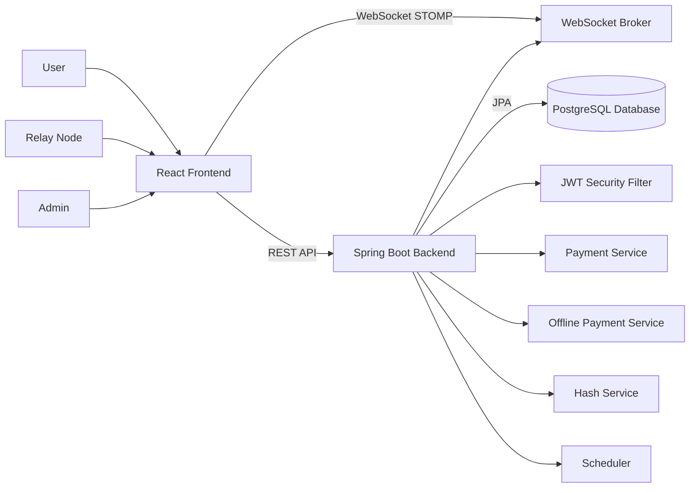
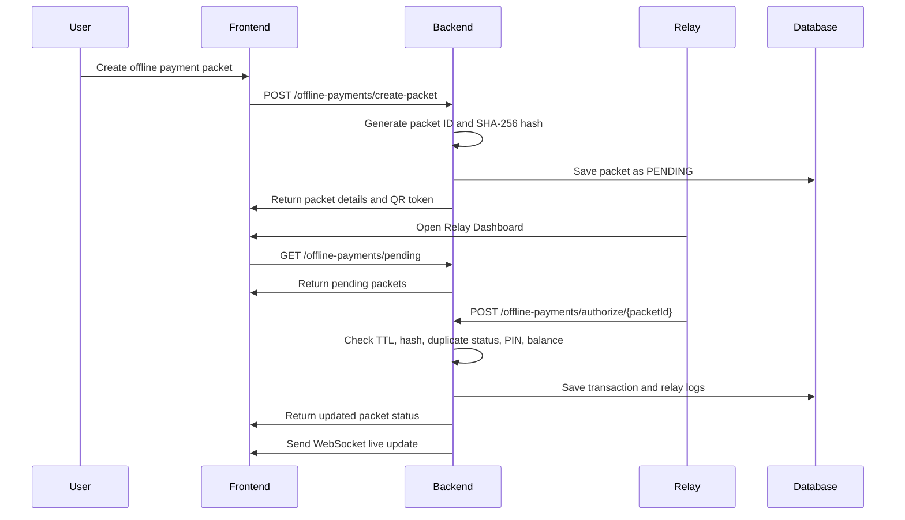

# Distributed Offline UPI Payment Simulator

A full-stack fintech simulation project that demonstrates how offline payment packets can be generated, relayed, verified, and settled using a secure backend workflow.

This project is **not connected to real UPI or any real banking network**. It is an educational simulator built to demonstrate distributed payment system concepts such as relay-node forwarding, offline packet validation, TTL expiry, idempotency, tamper detection, role-based access control, and real-time updates.

---

## Project Overview

The **Distributed Offline UPI Payment Simulator** allows users to create offline payment packets when the sender may not have internet access. These packets can later be picked up by a relay node, forwarded to the backend server, verified, and processed as simulated payments.

The system includes:

- Normal online money transfer
- Offline payment packet generation
- Relay node authorization
- QR-based packet sharing
- SHA-256 tamper detection
- TTL-based packet expiry
- Duplicate transaction prevention
- JWT authentication
- ADMIN/USER role-based access
- WebSocket live packet updates
- Admin analytics dashboard
- Transaction history and digital receipts

---

## Tech Stack

### Frontend
- React
- React Router DOM
- Axios
- SockJS
- STOMP/WebSocket
- React QR Code
- CSS custom design system

### Backend
- Spring Boot
- Spring Security
- JWT Authentication
- Spring Data JPA
- WebSocket/STOMP
- BCrypt password hashing

### Database
- PostgreSQL

---

## Key Features

### Authentication and Security
- User registration and login
- BCrypt password hashing
- UPI PIN hashing
- JWT-based authentication
- Role-based authorization using `USER` and `ADMIN`
- Protected backend APIs
- Custom `401 Unauthorized` and `403 Forbidden` responses
- Current-user verification using `/api/auth/me`

### Online Payment Module
- Send money between registered UPI IDs
- Balance validation
- UPI PIN verification
- Transaction status tracking
- Transaction history lookup
- Digital receipt generation

### Offline Payment Packet Module
- Create offline payment packets
- Generate unique packet IDs
- Add TTL window for packet validity
- Store packet hash for tamper detection
- QR code generation for packet sharing
- Packet status tracking

### Relay Node Module
- Relay node dashboard
- View pending packets
- Authorize and forward packets to bank server
- Internet availability simulation
- Relay logs for audit trail
- WebSocket live updates when packets are created or processed

### Fraud and Risk Checks
- High-value transaction logging
- Daily transaction limit
- Insufficient balance detection
- Wrong PIN detection
- Tampered packet detection
- Duplicate authorization handling
- Auto-expiry of pending packets

### Admin Dashboard
- Total users
- Total transactions
- Successful transactions
- Failed transactions
- Pending packets
- Success packets
- Failed packets
- Expired packets
- Tampered packets
- Total transferred amount

---

## System Architecture



---

## Offline Payment Flow



---

## Screenshots

Create a folder named `screenshots` in your GitHub repository and add your UI screenshots there.

Suggested names:

```text
screenshots/dashboard.png
screenshots/send-money.png
screenshots/check-balance.png
screenshots/history.png
screenshots/create-packet.png
screenshots/packet-status.png
screenshots/relay-dashboard.png
screenshots/admin-dashboard.png
```

Example:

```md


```

---

## Main Modules

### 1. Auth Module
Handles user registration, login, JWT generation, current user verification, and role-based access.

Important endpoints:

```http
POST /api/auth/register
POST /api/auth/login
GET  /api/auth/me
```

### 2. Payment Module
Handles online payments, transaction history, and receipt generation.

```http
POST /api/payments/send
GET  /api/payments/history/{upiId}
GET  /api/payments/receipt/{transactionId}
```

### 3. Offline Payment Module
Handles packet creation, packet status, pending packet queue, authorization, and relay logs.

```http
POST /api/offline-payments/create-packet
GET  /api/offline-payments/pending
POST /api/offline-payments/authorize/{packetId}
GET  /api/offline-payments/status/{packetId}
GET  /api/offline-payments/logs/{packetId}
```

### 4. Admin Module
Provides system-wide analytics. Accessible only to `ADMIN` users.

```http
GET /api/admin/dashboard
```

### 5. User Module
Provides user balance lookup.

```http
GET /api/users/balance/{upiId}
```

---

## Security Design

The backend uses JWT authentication with Spring Security.

### Flow

1. User logs in with email and password.
2. Backend validates the password using BCrypt.
3. Backend generates a JWT containing the user role.
4. Frontend stores the token.
5. Axios sends the token in every request:

```http
Authorization: Bearer <token>
```

6. JWT filter validates the token.
7. Spring Security checks user role.
8. Admin APIs are restricted to `ROLE_ADMIN`.

### Role Access

| Role | Access |
|---|---|
| USER | Banking, offline packets, relay dashboard, history, receipts |
| ADMIN | All USER features + Admin Dashboard |

---

## Local Setup

### Prerequisites

Install:

- Java 17+
- Maven
- Node.js
- PostgreSQL
- Git

---

## Backend Setup

1. Clone the repository.

```bash
git clone https://github.com/your-username/offline-upi-simulator.git
cd offline-upi-simulator/backend
```

2. Create PostgreSQL database.

```sql
CREATE DATABASE offline_upi;
```

3. Configure `application.properties`.

```properties
spring.datasource.url=jdbc:postgresql://localhost:5432/offline_upi
spring.datasource.username=postgres
spring.datasource.password=YOUR_POSTGRES_PASSWORD

spring.jpa.hibernate.ddl-auto=update
spring.jpa.show-sql=true
spring.jpa.properties.hibernate.format_sql=true

server.port=8080

jwt.secret=${JWT_SECRET}
jwt.expiration=86400000
```

4. Set JWT secret.

For Windows PowerShell:

```powershell
$env:JWT_SECRET="YOUR_BASE64_SECRET"
```

To generate a Base64 secret:

```powershell
[Convert]::ToBase64String((1..64 | ForEach-Object { Get-Random -Maximum 256 }))
```

5. Run the backend.

```bash
mvn spring-boot:run
```

Backend will run on:

```text
http://localhost:8080
```

---

## Frontend Setup

```bash
cd offline-upi-simulator/frontend
npm install
npm run dev
```

Frontend will run on:

```text
http://localhost:5173
```

---

## Testing Checklist

### Auth
- Register user
- Login as normal user
- Login as admin
- Check JWT token storage
- Logout
- Direct `/admin` access blocked for USER

### Online Payment
- Check balance
- Send money
- Verify transaction history
- Generate receipt

### Offline Payment
- Create packet
- Verify QR generation
- Check pending queue
- Authorize packet from relay dashboard
- Verify status update
- Check relay logs

### Security/Fraud
- Wrong UPI PIN
- Insufficient balance
- Daily transaction limit
- High-value transaction logging
- Tampered packet detection
- Expired packet
- Duplicate authorization

---

## Example Test Data

Normal payment:

```json
{
  "senderUpi": "priyanshu@offline",
  "receiverUpi": "rahul@offline",
  "amount": 500,
  "upiPin": "1234"
}
```

Offline packet:

```json
{
  "senderUpi": "priyanshu@offline",
  "receiverUpi": "rahul@offline",
  "amount": 100,
  "upiPin": "1234",
  "ttlSeconds": 200
}
```

Relay authorization:

```json
{
  "relayNodeId": "RELAY_1",
  "internetAvailable": true
}
```

---

## Project Highlights

This project demonstrates:

- Secure backend architecture with JWT and role-based access
- Real-time frontend updates using WebSocket
- Distributed payment simulation using relay nodes
- Cryptographic packet integrity validation
- Idempotent transaction processing
- Admin-level telemetry and monitoring
- Clean fintech dashboard UI

---

## Future Enhancements

- Global exception handling for all backend errors
- Docker Compose setup
- Email/mobile OTP simulation
- Advanced fraud scoring
- Packet encryption instead of only hash verification
- Role management screen for admin
- Export reports as PDF
- Deployment on cloud platform

---

## Resume Description

**Distributed Offline UPI Payment Simulator**  
Built a full-stack fintech simulation platform using React, Spring Boot, PostgreSQL, JWT, and WebSocket. Implemented offline payment packet generation, relay-node forwarding, SHA-256 tamper detection, TTL expiry, idempotent transaction handling, QR-based packet sharing, role-based admin security, transaction receipts, fraud-rule validation, and a real-time admin analytics dashboard.

---

## Disclaimer

This project is an educational simulation and is not connected to real UPI, NPCI, banks, payment gateways, or financial infrastructure. It is designed only to demonstrate secure distributed payment-system concepts.
